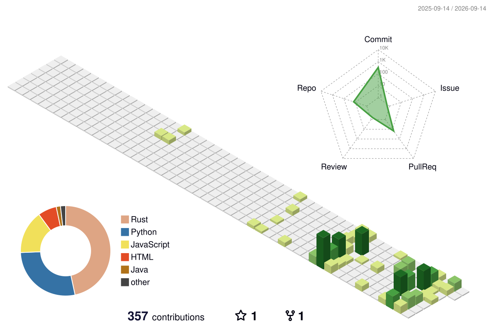

# 👋 Hai, Saya Azhar Muttaqien

<p align="center">
  
</p>

<p align="center">
  Mahasiswa <b>INFORMATIKA</b> di <b>Pasundan</b>, Bandung — yang entah bagaimana malah jatuh tertarik ke dunia CS, security research, dan low-level systems.
</p>

<p align="center">
  <i>"Bukan dari seorang ahli. Tapi dari rasa penasaran yang tidak berhenti."</i>
  <br>
  <i>Perjalanan belajarnya dimulai dari pertanyaan: "Apa sih software paling bagus buat recovery data, atau jangan-jangan ada pendekatan lain?"</i>
</p>

<p align="center">
  
</p>

---

### 🛠️ Apa yang Sedang Saya Kerjakan (Saat Ini)

- 💾 **Hardware Repair & Recovery**: Bereksperimen dengan berbagai macam Harddisk dan SSD untuk recovery atau repair.
- 🤖 **DevOps & Automasi**: Mencoba menggunakan Ansible untuk otomatisasi setup berbagai VM.
- ☁️ **DevOps Learning**: Membaca dan memahami seputar DevOps dan infrastruktur modern.
- 📝 **Knowledge Base**: Membangun vault catatan belajar publik berbasis Obsidian + Quartz.

---

### 🧠 Peta Belajar (Apa yang Aku Pelajari)

Peta besar yang dibangun sendiri dari nol, dari rasa penasaran:

```
💾 Data Recovery          → dari software sampai fisika kuantum
🦠 Endpoint Security      → dari antivirus sampai Intel ME Ring -3
🌐 Network Security       → dari Layer 1 sampai Layer 8 (manusia)
🤖 AI & Machine Learning  → dari IF-THEN sampai Omega Point
🔬 Reverse Engineering    → dari strings sampai FIB silicon edit
📡 RF & SIGINT            → dari RTL-SDR sampai Echelon NSA
🔐 Kriptografi            → dari Caesar Cipher sampai Post-Quantum
☁️ Cloud Infrastructure   → dari shared hosting sampai Zero Trust
🖥️ OS & Architecture      → dari transistor sampai kernel exploit
🕵️ OSINT                  → dari Google sampai Palantir Gotham
```

---

### 🛠️ Tools & Stack yang Pernah Dicoba

#### 🖥️ Operating Systems

<p>
  
  
  
  
  
</p>

#### 💻 Languages & Scripting

<p>
  
  
  
  
  
  
  
  
</p>

#### 🗄️ Databases & Web Technology

<p>
  
  
  
  
  
</p>

#### 🎨 Frontend, Mobile & Frameworks

<p>
  
  
  
  
  
  
</p>

#### 🌐 DevOps, Homelab & Security

<p>
  
  
  
  
  
  
</p>

---

### ⚡ Temukan Saya di

<p align="center">
  <a target="_blank" href="https://www.linkedin.com/in/azhar-muttaqien-a74a69237/"></a>
  <a target="_blank" href="https://www.instagram.com/azharmtq/"></a>
  <a target="_blank" href="mailto:azharsss457@gmail.com"></a>
  <a target="_blank" href="https://azharmtq.my.id"></a>
  <a target="_blank" href="https://azhar457.github.io/note/"></a>
</p>

---

### 📊 Statistik GitHub

<p align="center">
  
  
</p>

<p align="center">
  
</p>

<p align="center">
  <a href="https://github.com/ryo-ma/github-profile-trophy"></a>
</p>

---

### 🐍 GitHub Contributions Snake Game

<p align="center">
  <picture>
    <source media="(prefers-color-scheme: dark)" srcset="https://raw.githubusercontent.com/Azhar457/Azhar457/output/github-contribution-grid-snake-dark.svg" />
    <source media="(prefers-color-scheme: light)" srcset="https://raw.githubusercontent.com/Azhar457/Azhar457/output/github-contribution-grid-snake.svg" />
    
  </picture>
</p>

---

### 🏙️ 3D Contribution City

<p align="center">
  
</p>

